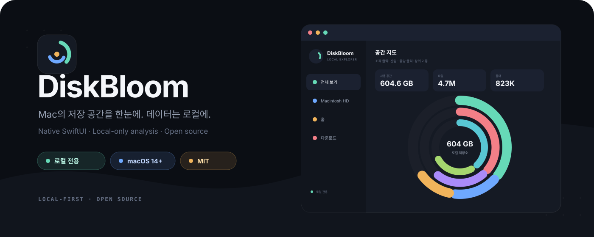

<p align="center">
  <strong>한국어</strong> · <a href="README_EN.md">English</a>
</p>

<p align="center">
  
</p>

<p align="center">
  <a href="https://github.com/lr3mon/DiskBloom/actions/workflows/ci.yml"></a>
  
  
  <a href="LICENSE"></a>
  
</p>

<p align="center">
  <strong>내 Mac의 저장 공간을 빠르고 안전하게 탐색하는 네이티브 디스크 분석기.</strong><br>
  파일명과 경로를 외부로 보내지 않고, 분석부터 시각화까지 모든 작업을 Mac 안에서 처리합니다.
</p>

<p align="center">
  <a href="#빠른-시작">빠른 시작</a> ·
  <a href="#개인정보-보호와-삭제-안전성">개인정보·안전</a> ·
  <a href="#프로젝트-구조">프로젝트 구조</a> ·
  <a href="#로드맵">로드맵</a> ·
  <a href="CONTRIBUTING.md">기여하기</a>
</p>

---

## 왜 DiskBloom인가요?

디스크 분석 앱은 넓은 파일 시스템 접근 권한을 필요로 합니다. DiskBloom은 그 권한을 가볍게 다루지 않습니다. 스캔은 사용자의 Mac에서 실행되고, 결과 스냅샷도 Mac에만 저장되며, 삭제 작업은 명시적인 안전 정책으로 제한됩니다.

| 빠르게 탐색 | 로컬에서만 처리 | 안전하게 정리 |
| --- | --- | --- |
| 애니메이션 선버스트, 캐시된 위치 즉시 전환, 대용량 파일 목록, 경로 검색 | 계정·서버·분석 SDK·텔레메트리·네트워크 요청 없음 | 영구 삭제 없이 휴지통만 사용. 파일 시스템·홈·시스템·볼륨 루트와 합산 노드 보호 |

> DaisyDisk는 유료 앱이지만, DiskBloom은 무료 오픈소스 앱입니다.

## 주요 기능

- **네이티브 macOS UI** — SwiftUI와 AppKit 기반
- **실제 할당 용량 분석** — 폴더와 연결된 로컬 볼륨 스캔
- **캐시 우선 실행** — `~/Library/Application Support/DiskBloom/local-storage-snapshot.json`을 즉시 복원
- **빠른 위치 탐색** — 저장소, 홈, 다운로드, 문서, 응용 프로그램을 재스캔 없이 전환
- **직접 선버스트 탐색** — 조각 클릭으로 진입하고 중앙 클릭으로 상위 이동
- **클라우드 안전 기본값** — iCloud 플레이스홀더와 주요 파일 제공자 경로 제외
- **APFS 중복 방지** — 시스템·데이터 볼륨과 특수 볼륨 중복 집계 방지
- **Quick Look 및 Finder 연동**
- **안전한 휴지통 이동** — 확인 과정과 보호 경로 정책 적용
- **대용량 트리 대응** — 심볼릭 링크 제외, 트리 압축, 취소, UI 깊이 제한
- **CLI 스캐너** — 터미널 분석과 디버깅 지원

## 작동 방식

```text
연결된 로컬 볼륨
        │
        ├── 대상 탐색 + 클라우드/APFS 제외
        │
        ├── 제한된 병렬 스캔
        │      ├── 실제 할당 용량 집계
        │      ├── 화면용 압축 트리
        │      └── 대용량 파일 힙
        │
        └── 로컬 JSON 스냅샷
               ├── 사이드바 위치 즉시 전환
               ├── 애니메이션 선버스트 지도
               └── Finder / Quick Look / 휴지통
```

첫 전체 분석이 끝나면 로컬 스냅샷을 저장합니다. 이후 실행에서는 스냅샷을 바로 복원하며, 사용자가 **전체 로컬 저장소 다시 스캔**을 선택할 때만 디스크를 다시 순회합니다.

## 조작 방법

| 조작 | 결과 |
| --- | --- |
| 사이드바 위치 행의 아무 곳이나 클릭 | 재스캔 없이 해당 캐시 위치로 전환 |
| 선버스트의 폴더·디스크 조각 클릭 | 해당 위치로 즉시 진입 |
| 선버스트 중앙 클릭 | 한 단계 상위로 이동 |
| 파일 또는 말단 조각 클릭 | 해당 항목 선택 및 상세 정보 표시 |
| 목록의 폴더 더블 클릭 | 캐시된 하위 폴더로 진입 |
| `⌘O` | 선택한 폴더를 임시 분석 |
| `⌘R` | 전체 로컬 저장소 다시 분석 |

## 빠른 시작

### 요구 사항

- macOS 14 Sonoma 이상
- Xcode 15.3 이상 또는 Swift 5.10 툴체인
- 앱 아이콘 생성을 위한 Python 3 및 [Pillow](https://pypi.org/project/pillow/)

### 빌드 및 실행

```bash
git clone https://github.com/lr3mon/DiskBloom.git
cd DiskBloom
python3 -m pip install --user Pillow
swift test
chmod +x Scripts/build_app.sh
./Scripts/build_app.sh
open dist/DiskBloom.app
```

생성 결과:

```text
dist/DiskBloom.app
dist/DiskBloom.zip
```

현재 로컬 빌드 스크립트는 ad-hoc 서명을 사용합니다. Developer ID 서명과 Apple 공증은 아직 구성되지 않았으므로 다른 Mac에서 실행할 때 **Control-클릭 → 열기**가 필요할 수 있습니다. 자세한 계획은 [로드맵](#로드맵)을 확인해 주세요.

### CLI

```bash
swift run diskbloom-scan ~/Downloads
```

## 전체 디스크 접근 권한

macOS 정책상 앱이 전체 디스크 접근 권한을 스스로 승인할 수는 없습니다. DiskBloom은 첫 자동 분석 전에 권한 상태를 확인하고 필요한 시스템 설정 화면을 엽니다.

1. **시스템 설정 → 개인정보 보호 및 보안 → 전체 디스크 접근** 열기
2. DiskBloom 활성화. 목록에 없으면 `+`로 `/Applications/DiskBloom.app` 추가
3. DiskBloom으로 돌아와 **권한 확인** 선택

제한된 권한으로도 계속할 수 있지만, 보호된 폴더는 건너뛰고 읽기 실패 항목으로 집계됩니다.

## 개인정보 보호와 삭제 안전성

### 데이터 처리

- 파일명·경로·용량·분석 결과를 외부로 전송하지 않습니다.
- 네트워크 클라이언트, 분석 SDK, 계정 시스템, 텔레메트리 엔드포인트가 없습니다.
- 스냅샷은 현재 사용자의 Application Support 디렉터리에만 저장합니다.
- 스냅샷 디렉터리는 `0700`, 캐시 파일은 `0600` 권한으로 제한합니다.
- 스냅샷은 시스템 백업 대상에서 제외하며 기존 파일도 실행 시 권한을 보정합니다.
- iCloud 플레이스홀더는 다운로드하지 않고 분석에서 제외합니다.

### 기본 분석 제외 경로

- `~/Library/CloudStorage`
- `~/Library/Mobile Documents`
- iCloud ubiquitous 항목과 파일 제공자 플레이스홀더
- OneDrive, Dropbox, Google Drive 제공자 루트
- 네트워크 및 백업 볼륨
- APFS Preboot, VM, Update 및 중복·특수 볼륨 경로
- `/.nofollow`, `/.resolve`, `/.vol`, `/.file`

### 삭제 정책

DiskBloom은 영구 삭제를 수행하지 않습니다. 사용자의 확인을 받은 뒤 macOS 휴지통 API만 사용하며 다음 항목은 차단합니다.

- 현재 분석 루트
- `/`, 사용자 홈 디렉터리, 보호된 시스템 최상위 경로
- `/Volumes` 아래의 연결된 볼륨 루트
- 합산·가상 노드와 실제 URL이 없는 노드

안전성 문제를 발견했다면 공개 Issue 대신 [SECURITY.md](SECURITY.md)의 비공개 신고 절차를 이용해 주세요.

## 프로젝트 구조

```text
DiskBloom/
├── Sources/
│   ├── DiskBloom/          # SwiftUI 앱, 탐색, 캐시 조율, AppKit 연동
│   ├── DiskBloomCore/      # 스캐너, 모델, 취소, 포맷, 삭제 정책
│   └── DiskBloomScan/      # CLI 실행 파일
├── Tests/
│   └── DiskBloomCoreTests/ # 스캔, 스냅샷, 제외, 안전 정책 테스트
├── Resources/              # Info.plist
├── Scripts/                # 앱 패키징과 원본 아이콘 생성
└── .github/                # CI, Issue 폼, 템플릿, 브랜딩
```

스캐너 코어는 UI와 분리되어 테스트와 CLI에서 함께 사용합니다. 런타임 외부 의존성을 두지 않았으며 Pillow는 패키징 시 아이콘을 생성할 때만 필요합니다.

## 개발 및 검증

```bash
swift test
swift build --product DiskBloom
swift build --product diskbloom-scan
```

패키지 앱 전체 검증:

```bash
./Scripts/build_app.sh
codesign --verify --deep --strict dist/DiskBloom.app
plutil -lint dist/DiskBloom.app/Contents/Info.plist
```

Pull Request를 보내기 전 [CONTRIBUTING.md](CONTRIBUTING.md)를 확인해 주세요.

## 로드맵

- [ ] Developer ID 서명 및 Apple 공증
- [ ] DMG 설치 파일과 검증된 GitHub Release
- [ ] 캐시 신선도 및 볼륨 UUID 검증
- [ ] 사용자가 선택한 폴더의 security-scoped bookmark 지원
- [ ] 권한 변경·손상된 스냅샷·다중 볼륨 예외 테스트 확대
- [ ] Instruments 기반 성능 기준과 회귀 임계값
- [ ] 영어를 포함한 앱 UI 다국어 지원
- [ ] VoiceOver 및 키보드 탐색 점검

출시 내역은 [CHANGELOG.md](CHANGELOG.md)에서 확인할 수 있습니다.

## English documentation

Full English documentation is available in [README_EN.md](README_EN.md).

## 라이선스

DiskBloom은 [MIT License](LICENSE)로 공개합니다.

Copyright © 2026 stpd_fx.
